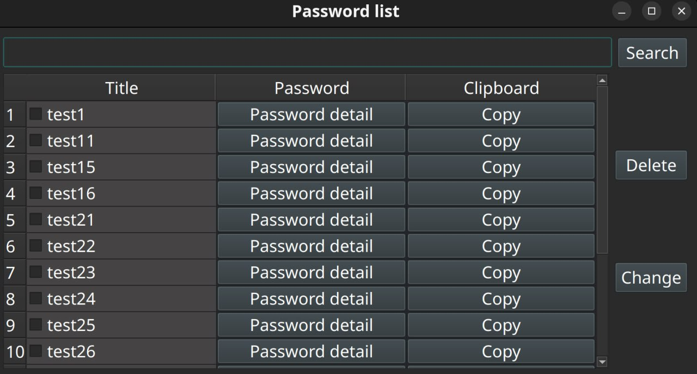
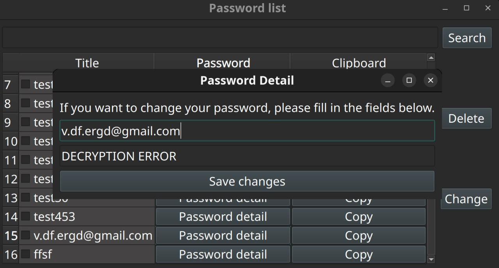

# Password Manager

Password Manager is a simple and user-friendly desktop application written in Python with a graphical interface built
using PySide6. It is designed for secure storage and management of passwords.

## Features

- Add new passwords with unique titles (e.g., website or service name).
- View a list of all saved passwords with search functionality by title.
- Edit and update existing entries.
- Delete selected passwords from the database.
- Copy passwords to clipboard with a single click.
- Generate random, strong, and secure passwords to enhance security.
- All data is stored locally in an SQLite database.

## Technologies

* Python 3
* PySide6 (Qt for Python) — for creating a modern, cross-platform GUI.
* SQLite — lightweight database for storing passwords.

## Installation

1. Clone the repository or copy the project folder to your local machine.
    ```bash
    git clone https://github.com/vitaleoneee/password-manager.git

2. Navigate to the project folder:
   ```bash
   cd password-manager
3. Create and activate a virtual environment:
    ```bash
   python -m venv .venv
   source .venv/bin/activate      # for Linux/macOS
    .venv\Scripts\activate         # for Windows
4. Install dependencies:
   ```bash
   pip install -r requirements.txt
5. Run the application
    ```bash
   python main.py

## 📸 Screenshots




